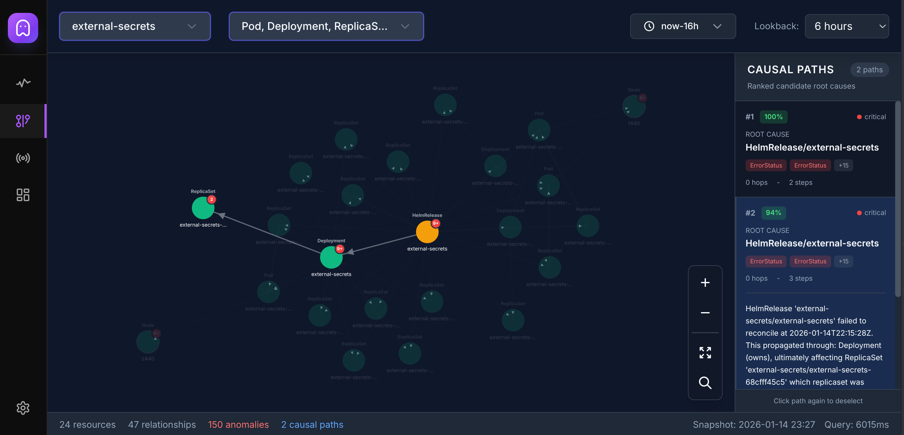

# Spectre

<div align="center">
  
</div>

<div align="center">

📚 **[Documentation](https://moolen.github.io/spectre/)** | 🚀 **[Quick Start](#quick-start)** | 🤖 **[MCP Integration](#mcp-integration)**

</div>

## What is Spectre?

Spectre is a Kubernetes observability system that captures resource changes across your cluster and stores them in a graph database. It provides timeline visualization, relationship mapping, anomaly detection, and root cause analysis through both a web UI and MCP integration for AI assistants.

<div align="center">
<table>
<tr>
<td></td>
<td></td>
</tr>
<tr>
<td align="center"><em>Timeline View</em></td>
<td align="center"><em>Graph View with Causal Paths</em></td>
</tr>
</table>
</div>

### Features

- **Event Capture** - Watches Kubernetes resources and records all create, update, delete operations
- **Graph Storage** - Stores resources and their relationships (ownership, references, scheduling) in FalkorDB
- **Timeline View** - Visualizes resource state changes over time with diff inspection
- **Graph View** - Displays resource relationships within a namespace with anomaly highlighting
- **Anomaly Detection** - Identifies crash loops, image pull failures, config errors, scaling issues
- **Causal Path Analysis** - Traces root causes through resource relationships using graph traversal
- **MCP Server** - Exposes cluster data to AI assistants for incident investigation

## Quick Start

### Using Helm

```bash
helm install spectre oci://ghcr.io/moolen/charts/spectre \
  --namespace monitoring \
  --create-namespace

kubectl port-forward -n monitoring svc/spectre 8080:8080

# Open your browser to http://localhost:8080
```

## Configuration

### Watcher Configuration

Create a `watcher.yaml` file to specify which resources to monitor:

```yaml
resources:
  - group: ""
    version: "v1"
    kind: "Pod"
    namespace: ""
  - group: "apps"
    version: "v1"
    kind: "Deployment"
    namespace: ""
```

## MCP Integration

Spectre runs an integrated MCP server on **port 8080** at the **/v1/mcp** endpoint. The MCP server runs in-process within the main Spectre server (not as a separate container) and provides AI assistants with direct access to cluster data during incident investigation.

### Connection

After port-forwarding the Spectre service (see [Quick Start](#quick-start)), connect your AI assistant to:

```
http://localhost:8080/v1/mcp
```

The MCP server exposes five tools:

### Tools

**cluster_health** - Returns cluster health overview for a time window. Reports resource counts by status (healthy, warning, error), lists unhealthy resources with their conditions, and identifies top issues. Supports filtering by namespace.

**resource_timeline** - Returns status timeline for resources matching kind/name/namespace filters. Shows status segments with durations, state transitions, and associated Kubernetes events. Used to understand when and how a resource's state changed.

**resource_timeline_changes** - Returns field-level diffs for specific resource UIDs. Filters out noise (managedFields, resourceVersion) and summarizes status condition changes. Shows what actually changed in the resource spec/status between versions.

**detect_anomalies** - Analyzes a resource and its causal subgraph for anomalies. Detects crash loops, image pull failures, OOMKills, probe failures, config reference errors, scaling issues, and network policy problems. Returns anomalies with severity, timestamps, and affected resources.

**causal_paths** - Given a failing resource UID and failure timestamp, traverses the resource graph backwards through ownership, reference, and management edges to find root causes. Returns ranked causal paths with confidence scores based on temporal proximity and relationship type.

### Prompts

The MCP server provides two investigation prompts:

**post_mortem_incident_analysis** - Guides systematic historical incident investigation. Calls cluster_health, then resource_timeline on affected resources, builds chronological timeline, identifies contributing factors.

**live_incident_handling** - Guides real-time incident triage. Focuses on recent data around incident start, identifies likely root cause, recommends immediate mitigation steps.
